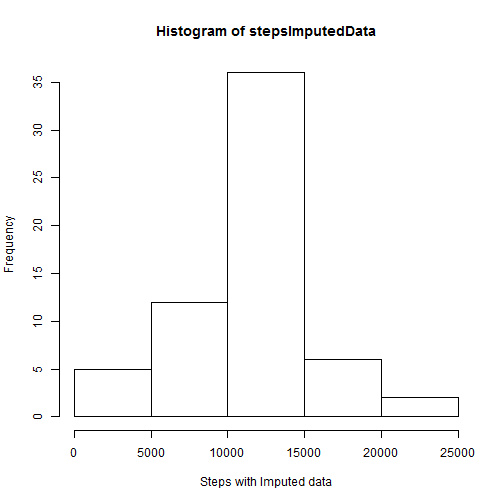
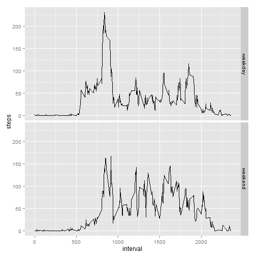

## Loading and preprocessing the data


```r
activity <- read.csv("../activity.csv")

## Get the steps sum for each day
stepsEachDay<-tapply(activity$steps, format(as.Date(activity$date),'%Y-%m-%d'), sum) 
```

## Plot the histogram for the average daily steps

```r
## Histogram for the average daily steps
hist(stepsEachDay, xlab="Average daily steps")
```

 


## What is mean total number of steps taken per day?

```r
##Get the mean for average daily steps
mean(stepsEachDay,na.rm=TRUE)
```

```
## [1] 10766.19
```

```r
## Get the median for average daily steps
median(stepsEachDay,na.rm=TRUE)
```

```
## [1] 10765
```


## What is the average daily activity pattern?

```r
dfPlotInterval <- aggregate(steps ~ interval, activity, mean, na.action = na.omit)
plot(dfPlotInterval$interval, dfPlotInterval$steps, type='l', xlab="Interval", ylab="Number of steps",xaxt='n')
axis(side = 1, at=c(seq(from=0,to=2355,by=100)),labels = TRUE)
```

 

## Average maximum number of steps in the 5 minute interval

```r
maxRow <- dfPlotInterval[which.max(dfPlotInterval[,2]),]
```

The time series plot reveals the row 835 on average has maximum number of steps


## Imputing missing values

```r
nasfound <- nrow(activity[!complete.cases(activity),])
```
The total number of missing values or NAs 2304


```r
## The strategy devised is to make use of the data.frame that calculates the average of the 5 minute interval

# Get complete cases from activity data frame
tobeupdatedactivity <- activity[complete.cases(activity),]

##Get the mean for the 5 minute interval averaged across all days
meanSteps <- aggregate(steps ~ interval, activity, mean, na.action = na.omit)

## impute the missing values
impute.v <- function(x,p) {
  dat <- subset(activity, activity$interval==p & is.na(activity$steps))
  rowI <- meanSteps[x,]
  dat <- replace(dat, 1,rowI$steps)
  return(dat)
}

## Loop through and replace 

for(i in 1:288) {
  getRow <- meanSteps[i,]
  replaceddata <- impute.v(i,getRow$interval)
  tobeupdatedactivity <- rbind(replaceddata,tobeupdatedactivity)
}

## Histogram/mean/median for original data frame with imputed data
stepsImputedData<-tapply(tobeupdatedactivity$steps, format(as.Date(tobeupdatedactivity$date),'%Y-%m-%d'), sum) 
```


```r
hist(stepsImputedData, xlab="Steps with Imputed data")
```

 


```r
mean(stepsImputedData)
```

```
## [1] 10766.19
```

```r
median(stepsImputedData)
```

```
## [1] 10766.19
```


## Are there differences in activity patterns between weekdays and weekends?

```r
library(lubridate)

weekdayPlot <- aggregate(steps ~ interval, data=subset(tobeupdatedactivity,wday(tobeupdatedactivity$date) > 1 & wday(tobeupdatedactivity$date) < 7 ), mean)

weekendPlot <- aggregate(steps ~ interval, data=subset(tobeupdatedactivity,wday(tobeupdatedactivity$date) == 1 | wday(tobeupdatedactivity$date) == 7 ), mean)

weekdayPlot$DaysofWeek <- c("weekday")
weekendPlot$DaysofWeek <- c("weekend")

daysofweekDF <- rbind(weekdayPlot,weekendPlot)
```


```r
library(ggplot2)
p <- ggplot(daysofweekDF, aes(interval, steps)) + geom_line()
p + facet_grid(DaysofWeek ~ .)
```

 


